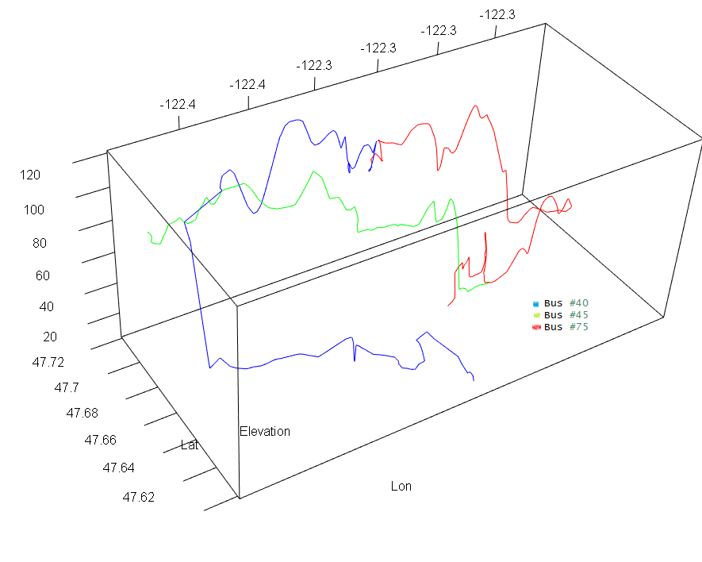
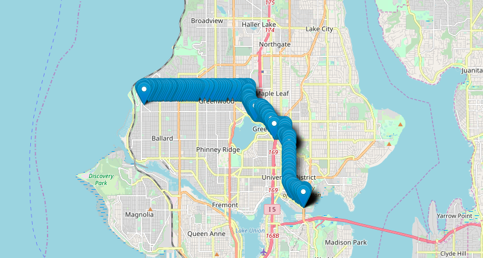
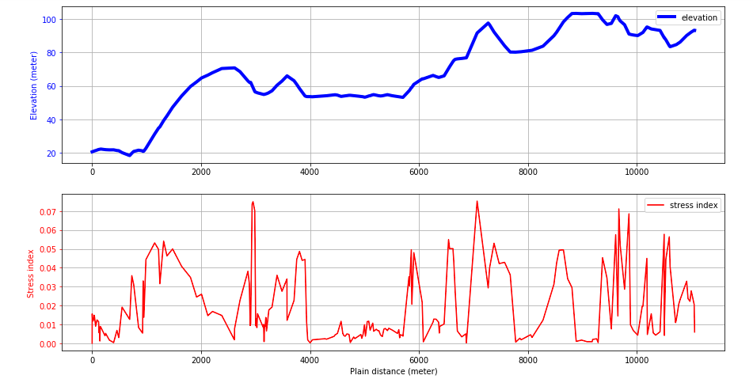
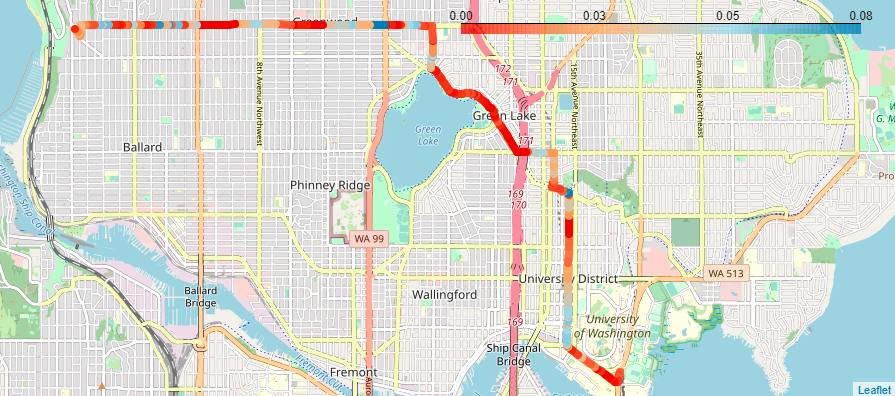
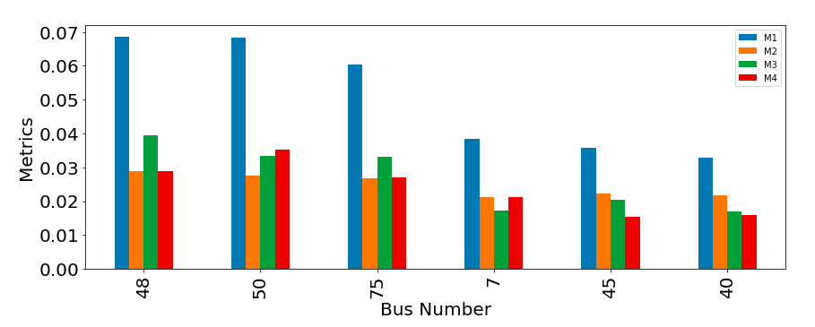

# Route Dynamics

DIRECT group project. This repo is a development version mostly containing fuctions for the project. The complete one is [here](https://github.com/EricaEgg/Route_Dynamics)

## Three bus routes in 3D

## Bus 45 in point 

## Bus 45 elevation profile and stress index

## Bus 45 stress visualization 

## Six buses stress rank

